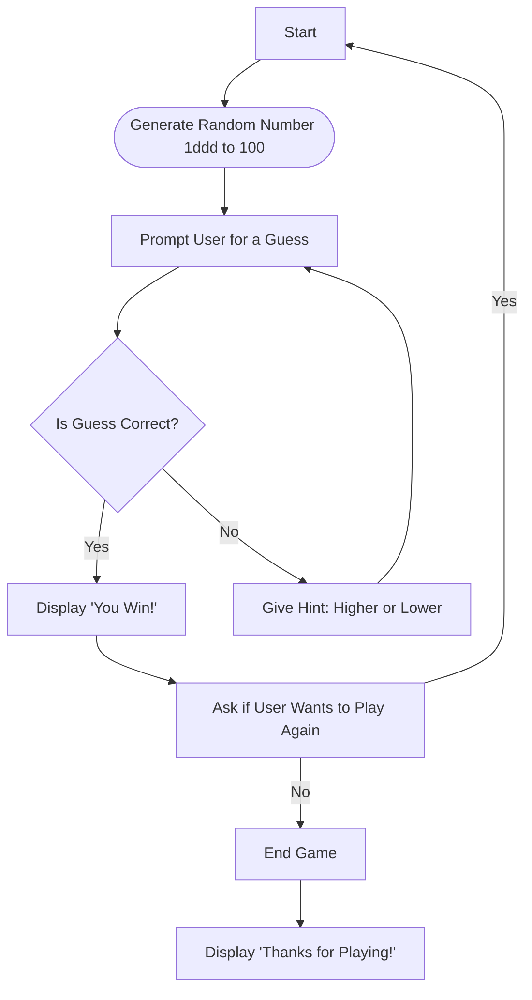

```mermaid
flowchart TD
  A[Start] --> B([Generate Random Number 1ddd to 100])
  B --> C[Prompt User for a Guess]
  C --> D{Is Guess Correct?}
  D -->|Yes| E[Display 'You Win!']
  D -->|No| F[Give Hint: Higher or Lower]
  F --> C
  E --> G[Ask if User Wants to Play Again]
  G -->|Yes| A
  G -->|No| H[End Game]
  H --> I[Display 'Thanks for Playing!']
```

### Assignment: Implementing a Random Guessing Game  
