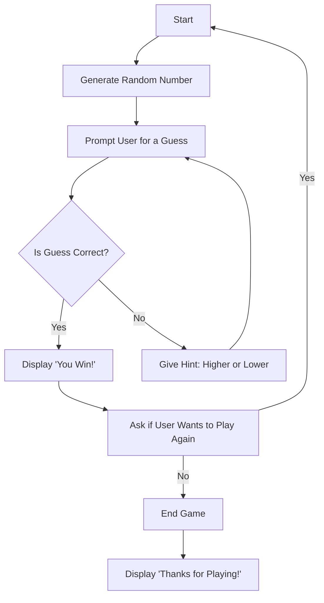

### Assignment: Implementing a Random Guessing Game  
1. First, A number will be generated with a limited to a range of 1 to 100.
2. Next, the player is prompted to guess the generated number. 
3. If the guess is correct, display that the player won. 
4. If false, display a hint that tells the player if it is lower or higher and prompt the user again.
5. If the player wins ask if they want to play again. Otherwise, end the game. 

